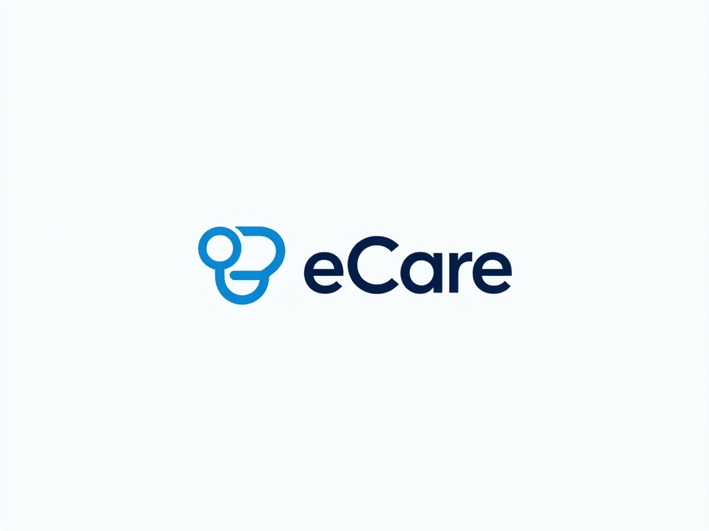

<p align="center">
  
</p>

<h1 align="center">eCare - Book, Track, Heal – Anytime, Anywhere!</h1>


eCare is a mobile application that simplifies doctor appointment booking. Patients can find doctors, schedule appointments, and manage prescriptions, while doctors can list availability and handle appointments efficiently.  

## 🚀 Features  
- **User Authentication** (Email & Google Sign-in)  
- **Doctor Listings & Search**  
- **Appointment Booking & Management**  
- **QR Code Check-in**  
- **Prescription Management**  
- **Real-time Notifications & Tracking**  
- **Offline Mode with Data Synchronization**  

## 🎨 UI/UX Design  
Check out the Figma design: [Figma Link](https://www.figma.com/design/VQXfI3RbxvGorogFeCJw8O/UI?node-id=7-7222&t=K7sVyZju8s8OBmTx-1)  

## 🛠️ Tech Stack  
- **Frontend (Mobile App)**: Kotlin (Jetpack Compose)  
- **Backend**: Ktor (Kotlin-based server)  
- **Database**: PostgreSQL 

## 📂 Setup & Installation  

### **1. Clone the repository**  
   ```sh
   git clone https://github.com/your-username/eCare.git
   cd eCare
   ```  

### **2. Mobile App (Kotlin - Jetpack Compose)**  
1. Open the `mobile/` folder in **Android Studio**  
2. Build & Run the app on an emulator or physical device  

### **3. Backend (Kotlin - Ktor)**  
1. Open the `backend/` folder in **IntelliJ IDEA**  
2. Install dependencies:  
   ```sh
   ./gradlew build
   ```  
3. Start the server:  
   ```sh
   ./gradlew run
   ```  

## 📌 Contributing  
We welcome contributions! Feel free to submit pull requests or report issues.  

## 📄 License  
This project is licensed under the MIT License.  
